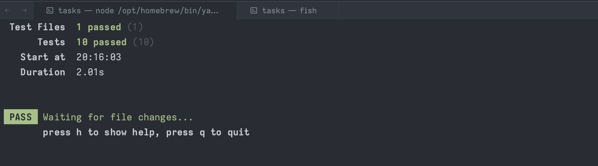

# Задачи для подготовки

10 задач с интервью Яндекса для подготовки к собеседованиям. 


## Установка и тесты

Тесты работают при помощи библиотеки [vitest](https://github.com/vitest-dev/vitest)

Устанавливаем vitest при помощи npm или yarn 
```
npm i
pnpm i
yarn 
```

Запускаем тесты при помощи команды vitest

```
npm run vitest
```



### Решения

Возможные решения задач доступны по оригинальному коммиту

